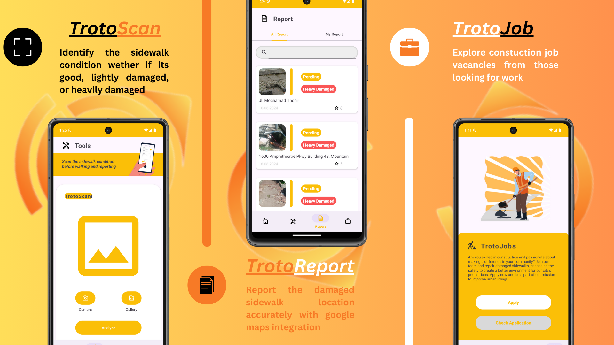

<p align="center">
   
</p>

---

## Introduction
<p align="justify">
  <strong>TrotoTrack</strong> is an application designed to facilitate the public in reporting sidewalk damage quickly and efficiently. Equipped with a Machine Learning-based 
  sidewalk damage detection system, and integrated with Google Maps to accurately display the damaged location. TrotoTrack facilitates sustainable urban development 
  by fostering collaboration between citizens and authorities in enhancing pedestrian facilities.
</p>
<br>

## Features

<p align="justify">
  <strong>TrotoScan :</strong> This innovative tool is designed to assess and identify the condition of sidewalks. It categorizes the sidewalk status into three distinct conditions: good, lightly damaged, or heavily damaged. 
  By using advanced scanning technology, TrotoScan ensures that the assessments are precise and reliable, facilitating better maintenance and repair planning.
  <br><br>
  <strong>TrotoReport :</strong> A comprehensive reporting tool that accurately logs the locations of damaged sidewalks. With seamless integration with Google Maps, TrotoReport allows users to pinpoint the exact locations of 
  sidewalk issues. This facilitates timely repairs and ensures that maintenance teams can address problems efficiently. The integration with Google Maps provides a user-friendly interface for tracking and managing 
  sidewalk conditions across large areas.
  <br><br>
  <strong>TrotoJob :</strong> A dynamic platform for exploring construction job vacancies, tailored specifically for those seeking employment in the sidewalk maintenance and repair sector. TrotoJob connects job seekers with 
  opportunities from employers looking to fill positions in construction and related fields. This platform streamlines the job search process, providing a centralized location for job listings and applications, 
  making it easier for skilled workers to find relevant job opportunities.
</p>
<br>

## Getting Started

### Requirement

Before you begin, ensure you have met the following requirements:

- **Android Studio**: Make sure you have Android Studio installed on your computer.
- **Kotlin**: The project uses Kotlin 1.8 or higher.
- **Gradle**: Ensure you have Gradle 8.0 or higher.

### Installation

Follow these steps to set up and run the project locally:

1. **Clone the repository:**

   Open your terminal and run the following command to clone the repository:

   ```bash
   git clone https://github.com/TrotoTrackApp/TrotoTrack-Mobile.git
   cd TrotoTrack-Mobile

2. **Open the project in Android Studio**
    - Launch Android Studio.
    - Select `Open an existing project`.
    - Navigate to the cloned directory and select it.

3. **Build the project**
    - Click on `Build` in the top menu.
    - Select `Make Project`.

4. **Run the app**
    - Connect your Android device via USB or start an emulator.
    - Click on `Run` in the top menu.
    - Select `Run 'app'`.
<br>

## Mobile Development Team

| Name                           | University	                                         | 
| :----------------------------- | :---------------------------------------------------| 
|	Muhammad Raihan Resa           | Universitas Muslim Indonesia                        |
|	Afifah Progestina Hafizh       | Universitas Gadjah Mada                             |	
